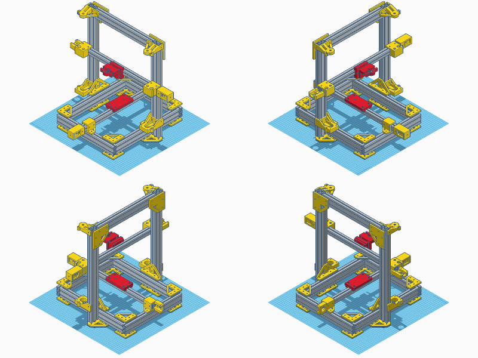

# Jarhead Printer

The Jarhead Printer is a 3D printer / CNC that is built to endure
heavy environments and still allowing maximum print precision and
quality.

It is originally derived from several other designs, such as the
Prusa i3, Anet AM8, OpenBuilds' Printbot and other printers. You
can see it as the evil cross-breed that tries to use advantages
of all other designs while trying to keep its design as simple
(and interchangeable) as possible.

However, the main focus of this printer is to being "built to endure"
so its design and its parts follow the KISS principle and still try
to allow flexible modifications and scaling of X/Y/Z print volume
dimensions.


## Features Overview

- 3D Printer for ABS, PLA, PETG
- CNC for Aluminium, Wood and Plastics
- Very sturdy, bubble-leveled frame
- X-Cart designed for replaceable tools
- Y-Cart designed for replaceable beds
- Interchangeable, simple part design
- Compatible with E3D V6 Bowden Extruder
- Cork- and Fiberglass-insulated heatbed


# Preview Pictures




## Print Settings

Print Settings:

```
material:             PLA (or ABS)
layer height:         0.2mm
wall thickness:       0.8mm
top/bottom thickness: 0.8mm
infill density:       80%
infill pattern:       tetrahedral
```

**ABS**:

If you want to use the 3D printer as an ABS and PETG printer,
it is recommended to print the `tools` parts with ABS so that
those can withstand higher temperatures.


## Printable Parts

**Frame**:

- [1x Z Endstop](./design/frame/1xZ_Endstop.stl)
- [1x Z Motor Mount Left](./design/frame/1xZ_Motor_Mount_Left.stl)
- [1x Z Motor Mount Left](./design/frame/1xZ_Motor_Mount_Right.stl)
- [1x Z Rod Holder Left](./design/frame/1xZ_Rod_Holder_Left.stl)
- [1x Z Rod Holder Right](./design/frame/1xZ_Rod_Holder_Right.stl)
- [2x Bottom Tee Plate](./design/frame/2xBottom_Tee_Plate.stl)
- [2x Side Tee Corner](./design/frame/2xSide_Tee_Corner.stl)
- [2x Top Corner Plate](./design/frame/2xTop_Corner_Plate.stl)
- [8x Bottom Corner Plate](./design/frame/8xBottom_Corner_Plate.stl)

**X-Carriage**:

The default X-Cart matches the specifications for Openbuilds Delrin Mini V Wheels.
The X-Left and X-Right parts must be mirrored (along the X-axis) to be used on the other side.

- [1x X-Cart](./design/x-carriage/1xX-Cart.stl)
- [1x X-Left with Motor Mount](./design/x-carriage/1xX-Left_with_Motor_Mount.stl)
- [1x X-Right with Belt Puller](./design/x-carriage/1xX-Right_with_Belt_Puller.stl)

**Y-Carriage**:

The default Y-Cart matches the specifications for Openbuilds Delrin Mini V Wheels.
The Y-Top and Y-Bottom parts can be used on both sides.

- [1x Y-Cart](./design/y-carriage/1xY-Cart.stl) or alternatively [1x Y-Cart for 605ZZ V Wheels](./design/y-carriage/1xY-Cart_for_605ZZ_V_Wheels.stl)
- [1x Y-Bottom with Belt Puller](./design/y-carriage/1xY-Bottom_with_Belt_Puller.stl)
- [1x Y-Top with Motor Mount](./design/y-carriage/1xY-Top_with_Motor_Mount.stl)

**Tensioners**:

The default Belt Tensioner matches the specifications for Openbuilds Pulley Idler Wheel.

- [2x Belt Tensioner](./design/tensioners/2xBelt_Tensioner.stl)
- [2x Belt Tensioner Knob](./design/tensioners/2xBelt_Tensioner_Knob.stl)
- [2x Belt Tensioner Wheel](./design/tensioners/2xBelt_Tensioner_Wheel.stl)

**Tools**:

The default E3D Tool Plate has no belt grip. If the part is printed on a 3D printer with
very good precision, it is recommended to print the variant with a Belt Grip.

- [1x E3D Tool Cap](./design/tools/1xE3D_Tool_Cap.stl)
- [1x E3D Tool Plate](./design/tools/1xE3D_Tool_Plate.stl) or alternatively [1x E3D Tool Plate with Belt Grip](./design/tools/1xE3D_Tool_Plate_with_Belt_Grip.stl)


## Other Parts

These reference parts are included in this repository, so it is
easier to customize the printable parts and/or print them as
replacement or prototyping parts.

- [2020 Alu Profile](./design/parts/2020_Alu_Profile.stl)
- [2040 Alu Profile](./design/parts/2040_Alu_Profile.stl)
- [605ZZ V Wheel](./design/parts/605ZZ_V_Wheel.stl)
- [GT20 Pulley](./design/parts/GT20_Pulley.stl)
- [GT20 Wheel](./design/parts/GT20_Wheel.stl)
- [M5 T-Nut](./design/parts/M5_T_Nut.stl)


## Bill of Materials

**Frame Parts**

The printer frame is built with `2040` extrusions while the
X-Axis (that moves the extruder) and Y-Axis (that moves the heatbed)
use `2020` extrusions.

Every frame dimension is freely scaleable, as all printable parts
are prepared for that use case. Please use the [calculator](https://rawgit.com/cookiengineer/jarhead-printer/master/calculator/index.html)
that is included in this repository.

| Amount | Description                         | Length | Usage   |
|--------|-------------------------------------|--------|---------|
| 2x     | 2040 Aluminium Profile B-Type Nut 6 | 440mm  | Z-Frame |
| 2x     | 2040 Aluminium Profile B-Type Nut 6 | 340mm  | Y-Frame |
| 3x     | 2040 Aluminium Profile B-Type Nut 6 | 310mm  | X-Frame |
| 1x     | 2020 Aluminium Profile B-Type Nut 6 | 425mm  | X-Axis  |
| 1x     | 2020 Aluminium Profile B-Type Nut 6 | 380mm  | Y-Axis  |
| 2x     | 8mm Rod                             | 400mm  | Z-Axis  |
| 2x     | 8mm Threaded Rod                    | 360mm  | Z-Axis  |

**Electronics**

| Amount | Description                            |
|--------|----------------------------------------|
| 1x     | E3D V6 Hotend                          |
| 1x     | Hotbed MK2B 200mm x 200mm              |
| 1x     | RAMPS Kit with 5 motor drivers and LCD |
| 5x     | NEMA17 Stepper Motor                   |

If you want to use a different Hotbed size, adjust the X and Y dimension
for the frame parts accordingly.

**Mechanical Parts**

| Amount | Description                         | Usage                                         |
|--------|-------------------------------------|-----------------------------------------------|
| 16x    | M3x20mm Bolt                        | Stepper Motors                                |
| 96x    | M5x10mm Bolt                        | Frame                                         |
| 4x     | M5x16mm Bolt                        | X-Cart to Tool Plate, Y-Cart to Heatbed Plate |
| 10x    | M5x30mm Bolt                        | X-Cart and Y-Cart Wheels, Tool Plate          |
| 4x     | M6x20mm Bolt                        | Z-Frame to Bottom Tee Plate                   |
| 114x   | M5 T-Slot Nut                       | Frame, X-Cart, Y-Cart and Wheels              |
| 2x     | M8 Nut                              | Threaded Rods to X-Left and X-Right           |
| 2x     | ABEC-5 608ZZ Bearing                | Threaded Rods to Z-Rod Holder                 |
| 16x    | ABEC-5 605ZZ Bearing                | X-Cart Wheels, Y-Cart Wheels                  |
| 8x     | M5 self-locking Nut                 | X-Cart Wheels, Y-Cart Wheels                  |
| 2x     | 5x8mm Aluminium Z-Coupler           | Stepper Motors to Z-Rods                      |

The X-Cart and Y-Cart design is compatible with the Openbuilds Delrin Mini
V Wheels and if those are used the 605ZZ bearings are not necessary.


# Work in Progress

- Endstop Integration (possible part redesign upcoming)
- Extruder Motor Design (unsure which is best atm)
- Mainboard Mount Design
- Power Supply Mount Design
- Firmware (probably a Marlin fork)


# FAQ

- How's the name "Jarhead" related to this?
  1. It looks like a jar.
  2. It tries to achieve military precision.
  3. It has replaceable heads.
  4. ...
  5. I guess you get it now.

